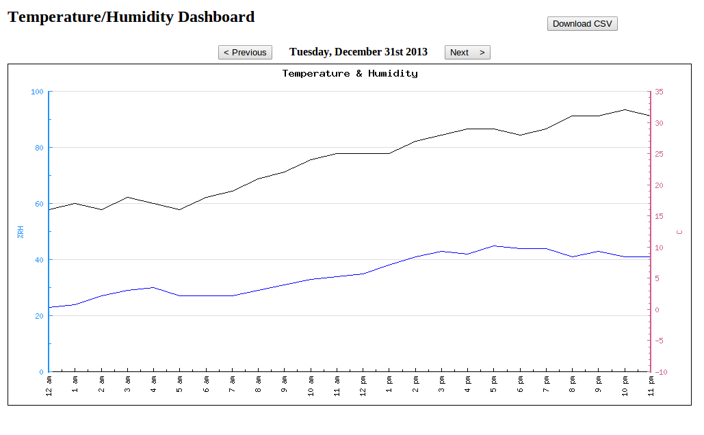
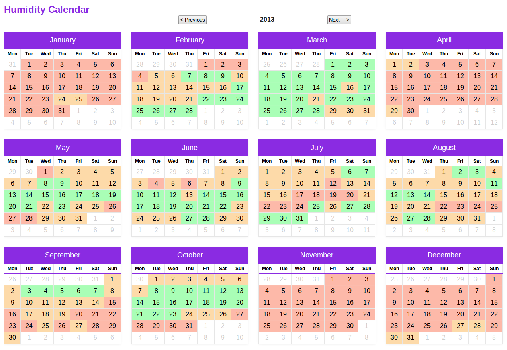
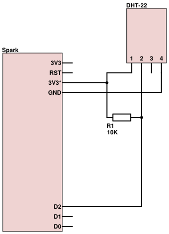

temperature-humidity-dashboard
==============================

LAMP based Temperature and Humidity Web Dashboard for the Spark Core

### Consists of:
1. PHP pages to add a device and view graphs
2. Firmware to send the temperature and humidity to the web pages (for sensor dht22)
3. Scripts and instructions to set-up the website and install on Ubuntu 14.04

### Screenshot

  
   
  Reproduced with permission from John-Daniel Trask
   
  <a href="https://raygun.io/blog/2014/09/home-automation-the-easy-way/">Home Automation the easy way: My experience with the Spark Core</a>

