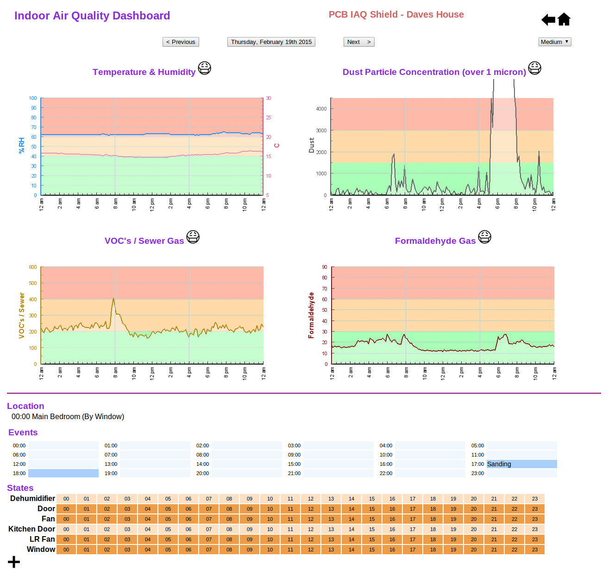

indoor-air-quality-dashboard
==============================

LAMP based Indoor Air Quality Web Dashboard for the Particle Photon

### Directories
|Directory           |Description                                                      |
|--------------------|-----------------------------------------------------------------|
|ancillary           |Installation and setup instructions                              |
|foobot              |Python code to read foobot data and send to the dashboard        |
|www                 |PHP Web pages to view graphs of collected data                   |

Website Features
=================

1. Web-based graphs to show history of sensor data.
 
2. Web-based histograms to analyze sensor data.

3. Web-based calendar to show which days in history reached poor air quality for each sensor.

4. User can record which room and position in each room for the sensor.
 
5. User can record events (such as opening windows or cleaning).

6. Download csv so user can use raw sensor data in excel etc.
 
7. Code to upload the downloaded data to a separate server.

8. Basic information about the particles/gases to tell the user about sources and symptoms  

### Screenshots

  
  Graph Page
     

  
  Calendar Page
    

  
  Average Page
    

  
  Histogram Page
    

