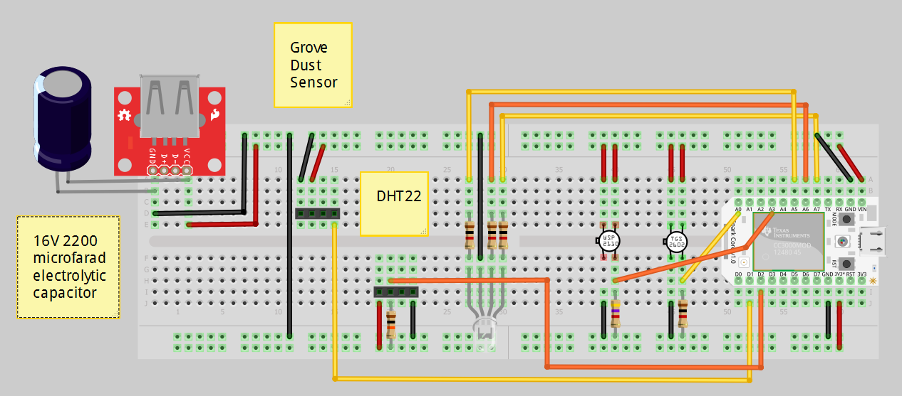
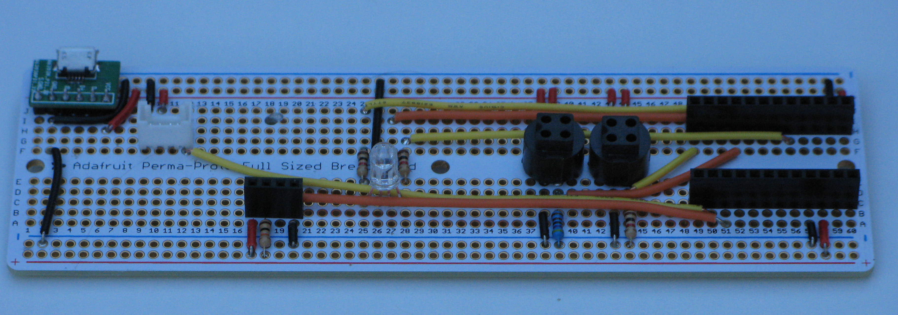
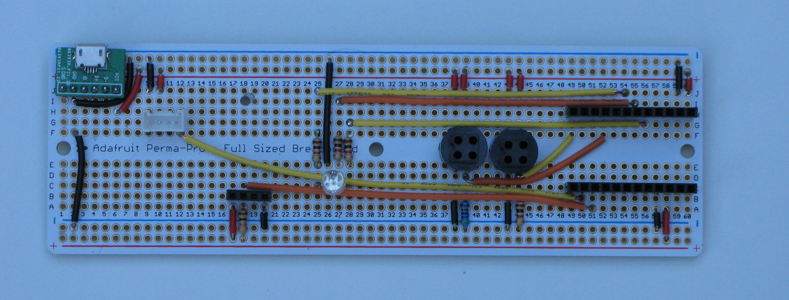

# breadboard

Breadboard schematics to make an indoor air quality monitor with the most important sensors.

  
   
  Indoor Air Quality Monitor Breadboard.

# protoboard

  
   
  Indoor Air Quality Monitor Protoboard Side View

  
   
  Indoor Air Quality Monitor Protoboard Top View

### Parts List
|Part                                        |Source  |Price   |Qty  |Note       |
|--------------------------------------------|--------|--------|-----|-----------|
|Spark Core                                  |AF      |$40     |     |           |
|*(alternatively new Spark Photon = $20)*    |        | -      |     |           |
|Adafruit Perma-Proto Full Size breadboard   |AF      |$6.50   |     |           |
|Micro USB B Female Breakout Board	         |EB      |$3      |     |           |
|Figaro SR6 Socket                           |FI      |$6.50   |2    |(optional) |
|*(alternatively Figaro SR7 Socket = $1.50)* |        | -      |     |           |
|RGB LED                                     |        | -      |     |           |
|4-pin 2.54mm Pitch Female Single Row Header |EB      | -      |     |(optional) |
|12-pin 2.54mm Pitch Female Single Row Header|EB      | -      |2    |           |
|Grove Universal 4-pin connector             |SS      | -      |     |(optional) |
|1K resistor                                 |        | -      |4    |           |
|10K resistor                                |        | -      |     |           |
|4.7K resistor                               |        | -      |     |           |
|Assorted 22 AWG solid jumper wire           |        | -      |     |           |
|2.1A USB Wall Charger                       |EB      |$2      |     |           |

<i>Optional items - can solder components directly instead</i>

### Sensors
|Name               |Type                   |Source  |Price   |
|-------------------|-----------------------|--------|--------|
|Figaro TGS2602     |VOCs / Sewer Gas       |AE      |$6.50   |
|WSP2110            |Formaldehyde           |AE      |$15     |
|Grove Dust Sensor  |Dust                   |SS      |$16     |
|DHT22              |Temperature / Humidity |AE      |$3.50   |

``AF = Adafruit    EB = Ebay    FI = Figaro    AE = AliExpress    SS = Seeedstudio``

### Files
|File                        |Description                                                              |
|----------------------------|-------------------------------------------------------------------------|
|indoor_air_quality.fzz      |Fritzing file for the indoor air quality monitor breadboard              |
|WSP-2110.fzpz               |Fritzing file for the WSP-2110 HCHO sensor (same as Grove HCHO sensor)   |

