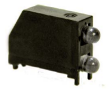

# documentation

Discussion of the Sensors and Components on the Indoor Air Quality Shield.

  
   
  Indoor Air Quality shield - also showing proposed orientation inside enclosure.

## Sensors <a href="SENSORS.md">Sensors</a>

## Components
#### Pair Digital Grove Ports
The hardware designer used a pair of these ports which share the 2 data lines. This allows for either one sensor requiring 2 data lines, or 2 sensors each requiring 1 data line. This is a good solution which makes the best use of available data lines.

<i>The Grove sockets used should be reviewed since they require trimming of the Grove Connectors before the Connectors will fit.</i>
#### Pair Analog Grove Ports
I propose adding a pair of analog Grove Ports in the same data line configuration as the existing digital ports. 

If these ports are added I recommend placing them in the same location as the exisiting grove ports, and moving the digital grove ports to the other side of the board. I recommend placing these ports apart from each other since the grove sensors are supplied with short cables and it would be tricky to put 4 sensors on 1 side of the board.
#### Switches
I plan to put the IAQ shield into an enclosure, I could not find a simple way to press the switches once the shield is in an enclosure. Replacing the switches with right-angled long actuator switches would enable the buttons to stick out the top of the enclosure. 

<a href="http://www.digikey.com/product-detail/en/TL1105SF160Q/EG1839-ND/13532">Right-Angled Long Actuator Switches</a>
#### RGB LED
The RGB LED could be seen if a transparent enclosure is used, but there is a smaller selection of these enclosures off-the-shelf. I recommend replacing the RGB LED with one which supports a right-angle light pipe - this would allow the LED to poke out the top of the enclosure.

<a href="http://www.digikey.ca/Web%20Export/Supplier%20Content/Dialight_350/PDF/dialight-sg-surface-mount-leds.pdf?redirected=1">LEDs for Light-Pipes</a>

## Data Line Shortages
In the case where we run short on data lines for the hardware design these are the components I would recommend dropping. Start of list is first component to lose.

1. MQ Sockets - Many of the MQ sensors are not sensitive enough to notice anything in a home environment. There are a few with reasonable sensitivity - of which a couple can be purchased as grove sensors, so I place the analog Grove ports higher in the priority list.
2. MICS-4514 - this sensor is definitely useful in an indoor air quality monitor, but I believe that the other sensors are complimentary to each other and to the locations and events system in the dashboard which is used to locate the sources of problems. Carbon Monoxide (CO) is in a different category where as soon as you have a reading, finding the source is typically more straightforward. CO could be something to visit in a separate shield. This chip has 2 sensors in one package, so if only 1 data line is needed the MICS-5524 could be used instead as it does not have the NOx sensor.
3. Buzzer - for me, the buzzer is tied to the CO and an emergency situation, so if the CO sensor is gone it would be fine to lose the buzzer.
4. RGB LED - It would be fine to downgrade to 2 LEDs instead if we are short on lines.

  
   
  Right-Angle LED Pair

5. WSP-2110 - I would prefer to have the Formaldehyde sensor onboard, but the analog Grove ports allow for the Grove HCHO Sensor which contains the WSP-2110. The cost to regular purchasers is practically the same for the standalone sensor or the Grove HCHO sensor.
