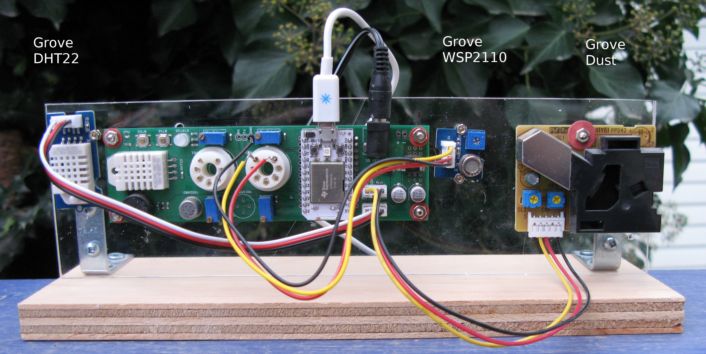

# documentation

Discussion of the Sensors and Components on the Indoor Air Quality Shield.

  
   
  Indoor Air Quality shield - also showing proposed orientation inside enclosure.

## <a href="SENSORS.md">Sensors</a>

## <a href="COMPONENTS.md">Components</a>

## <a href="DATA_LINE_SHORTAGES.md">Data Line Shortages</a>

## <a href="health">Health</a>
