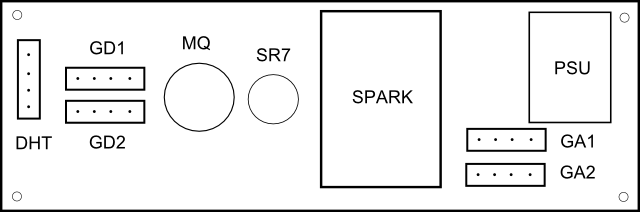

# simple shield

  
   
  Simple Shield

### Socket
|Name |Socket                     |Price    |Sensor          |Gas                   |Port
|-----|---------------------------|---------|----------------|----------------------|------
|DHT  |4-pin 2.54mm Female Header |20c      |DHT22           |Temperature/Humidity  |D2
|GD1  |Grove Digital Socket       |9c       |Shinyei PPD42NS |Dust                  |D0+D1
|GD2  |Grove Digital Socket       |9c       |&lt;spare&gt;   |                      |D0+D1
|SR7  |Figaro SR-7 Socket         |62c      |Figaro TGS-2602 |Sewer/VOCs            |A0
|MQ   |MQ Series Socket           |65c      |MQ-9            |Carbon Monoxide       |A1
|GA1  |Grove Analog Socket        |65c      |Grove HCHO      |Formaldehyde          |A2+A3
|GA2  |Grove Analog Socket        |65c      |&lt;spare&gt;   |                      |A2+A3

