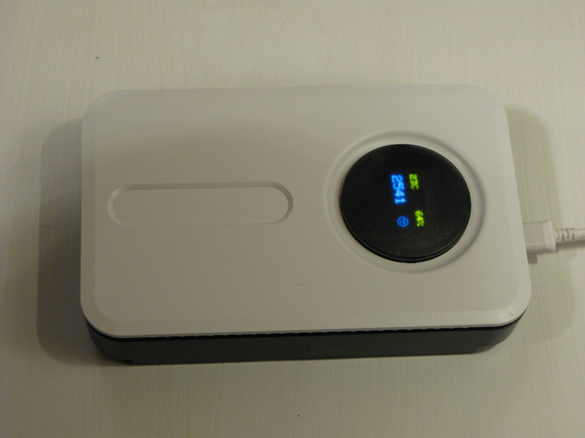
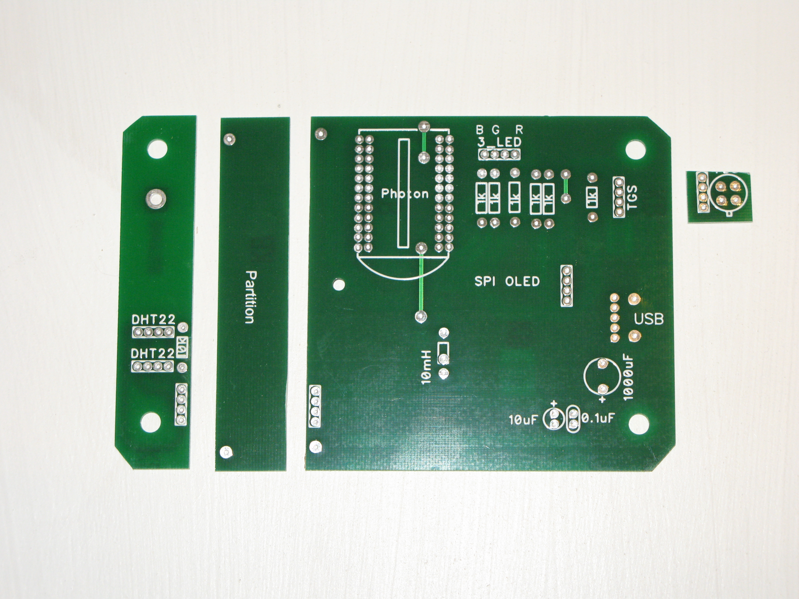
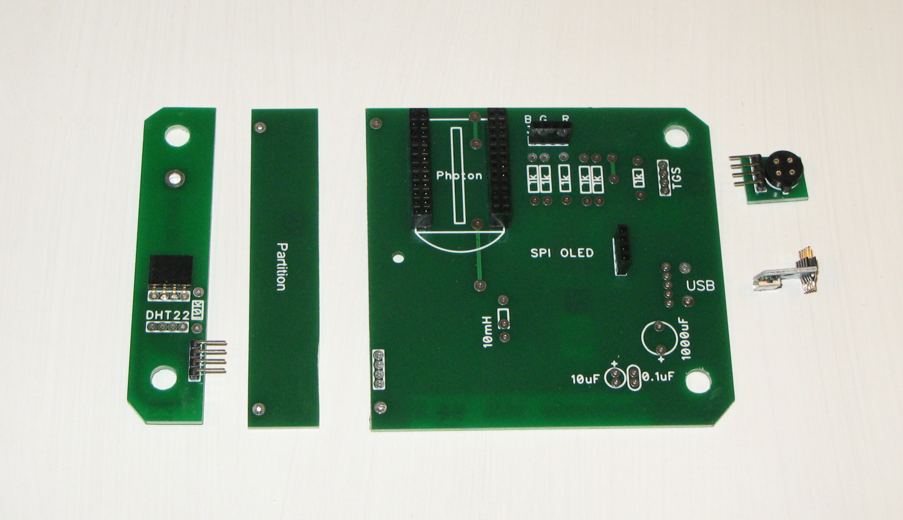
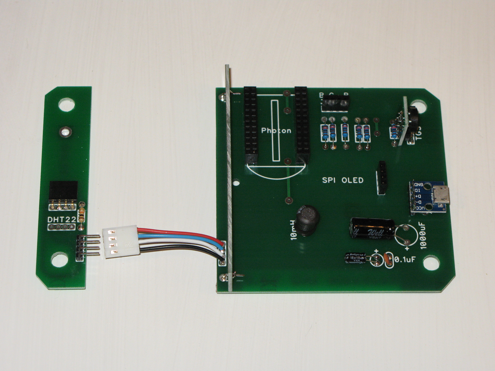
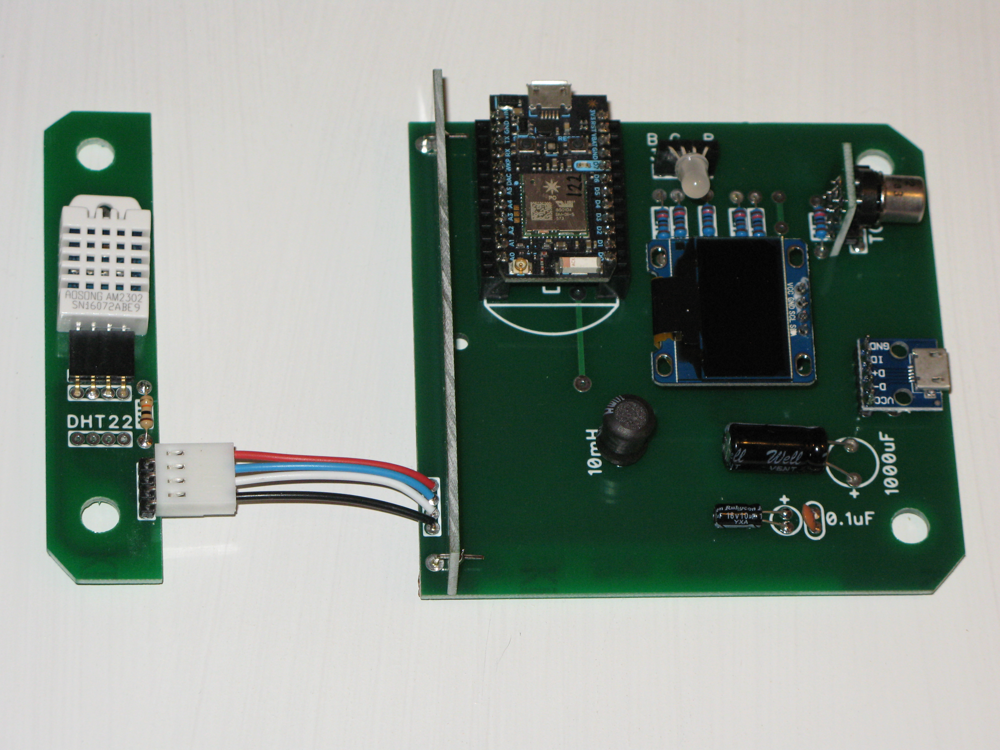

Hardware
========

  
   
  Indoor Air Quality shield in off-the-shelf enclosure

Diptrace Schematics
===================
<a href="Dave_proto_pcb_3_1_final_filled.dip" title="Repository">V3.1</a>

Assembley Photos
================

  
   
  Board cut into initial pieces.

  
   
  Board with headers soldered on.

  
   
  Board with components soldered on.

  
   
  Board with sensors plugged in.

  
   
  Enclosure with USB and sensor holes cut.

