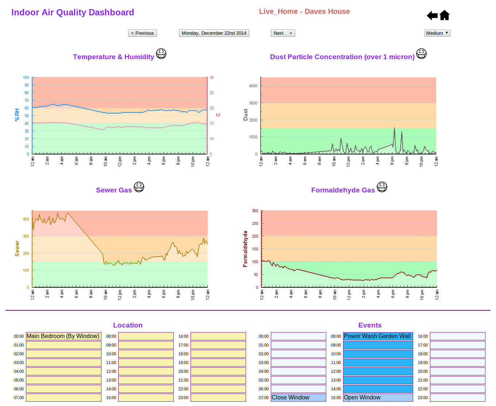

Website Features
=================

1. Web-based graphs to show history of sensor data.

2. Web-based calendar to show which days in history reached poor air quality for each sensor.

3. User can change the name of the room the shield is placed in to keep track of differences.

4. Download csv so user can use raw sensor data in excel etc.

5. Basic information about the particles/gases to tell the user about sources and symptoms  

### Screenshots

